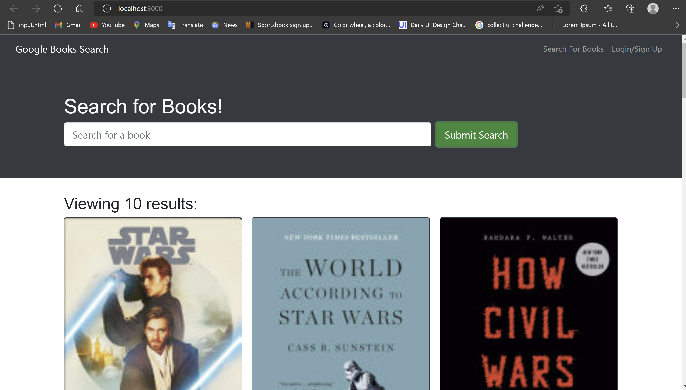

## Table of Contents
- [Description](#description)
- [Installation](#installation)
- [Usage](#usage)
- [Contribution](#contribution)
- [Testing](#testing)
- [Screenshot](#screenshot)

## Description:
Project based on creating an Function Google Books API engine which is build with RESTful API that renders any book by clicking the Search Bar and also once your login to your account you can saved and deleted books as your preference. The API was build with Apollo Server and also we used The MERN stack with REACT front end, MongoDB database, Node.js and Express.js

## Installation:
We are going to used npm install in the root folder of the project and ti will  to install all the packages needed.

## Usage:
We used the project by cloning the repo and and start the project by installing the dependencies using npm i in the root folder of the project,  and do a npm start  to display the server http://localhost:3000/ in the browser

## References:
I used the modules for further reference....

## License:
This license is public used you can find it on:
https://opensource.org/licenses/MIT

## Contribution:
Yes you can contribute to the project by sending me  an email.

## Testing:
You can test the project by cloning the repository and start the project by installing the dependencies in the root folder of the project using npm i, and the next step your going to go the terminal and type npm start to run the project.

## Screenshot:

## Contact Information:
- Github: https://github.com/wilmerojeda13.
- Email: ojedawilmerantonio@gmail.com. 